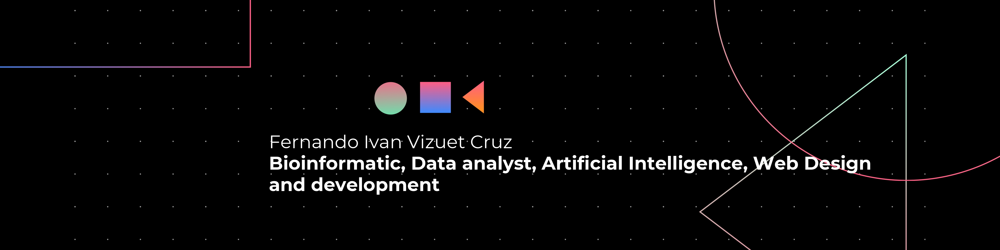

<h1 align="center">Hello There! I am Vizuetcf09 👨‍🚀</h1>

- **Bioinformatic.**
- **Data Analyst.**
- **Web Design.**
- **Front-end Development.**

## Skills

### Web Development

  <!-- Languages -->

  <!-- TypeScript -->
    
  <!-- Sass -->
  
    <!-- HTML5 -->
  
  <!-- CSS3 -->
  
    <!-- JavaScript -->
  
  <!-- NodeJS -->
  

<!-- Frameworks -->

  <!-- Bootstrap -->
  
  <!-- React -->
  
  <!-- Django -->
  

### Data Analysis and Machine Learning

<!-- Languajes -->

  <!-- Python -->
  
  <!-- R -->
  
  <!-- MySQL -->
  

  <!-- TensorFlow -->
  

### Web Design

  
  
  
  
  

### Operating System and IDEs

<!-- IDE -->

  <!-- VSCode -->
  

<!-- SO -->

  <!-- Linux -->
  

# Hello 🌎!

# Projects

# Contact
